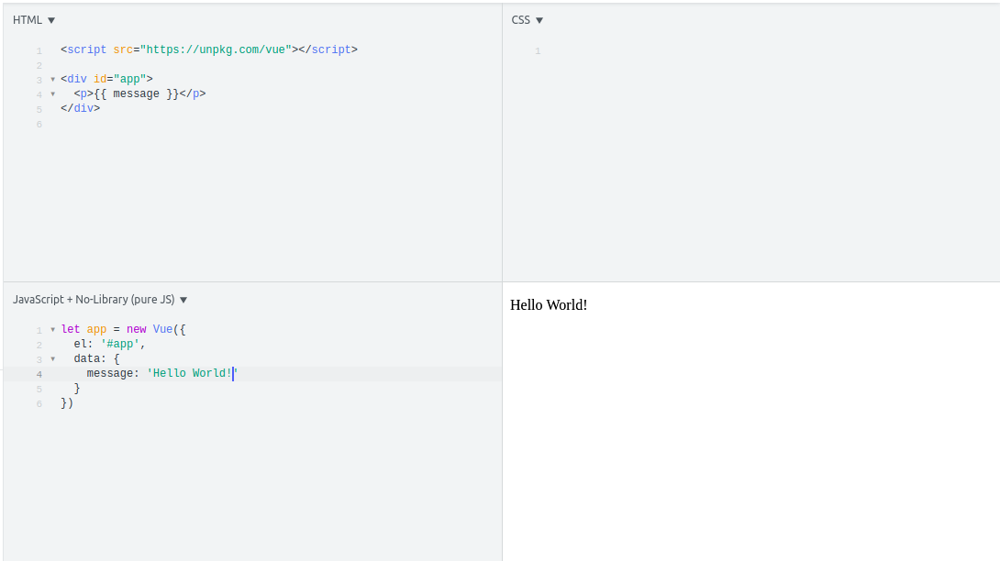

Welcome to my blog!

This is a blog for absolute beginners to Vue.js, from an absolute beginner to Vue.js!

Here I will talk about everything I cover on Vue.js and then try and teach the same to you, my faithful readers!

So to kickoff I will start with the archetypal first program everyone writes in a new language/framework. Printing **Hello World!** on to the screen!

---

Before we get our hands dirty with code, what really is Vue.js?

Vue.js is a progressive Javascript framework used to build user interfaces. It's called progressive because it is incrementally adoptable - it is easy to use and to integrate with other frameworks and libraries.

I'm sure this will become more apparent to us as we go along so let's get started.

There are many possible ways to install Vue.js, but we will start easy, with minimal setup as possible by using the Vue.js CDN. You can use JSFiddle or create your own index.html file and attach the following script:

```html
<script src="https://cdn.jsdelivr.net/npm/vue/dist/vue.js"></script>
```

In the html file create a div tag and assign it an id 'app'. Inside the div, write <code>{{ message }}</code>. Our html code will look something like this.

```html
<script src="https://cdn.jsdelivr.net/npm/vue/dist/vue.js"></script>
<div id="app">
  {{ message }}
</div>
```

In the JS file write the following, save and then run.

```javascript
let app = new Vue({
  el: '#app',
  data: {
    message: 'Hello World!'
  }
});
```

Voila! And that's our very first Vue.js app done and dusted!



We got the desired output, but like me you must be wondering what just happened?

As you can see, we pass an object to the <code>new Vue()</code> instance. Vue.js binds itself to the element with the <code>id</code> that we provide in the <code>el</code> property. And now everything, from what to display in the element to how to behave during events can be controlled from the Vue instance. We get access to the <code>Vue()</code> constructor thanks to the CDN we attached in the beginning of the HTML file.

Now you must have noticed this <code>data</code> property. All the properties inside it is used to store values needed in our app. These properties are now added to Vue's reactivity system. Whenever the values of these properties change, the view will rerender and the new value will be shown. Go to the console and set <code>app.message</code> to a new value and you can see the output change.

Vue.js uses template syntax (also known as string interpolation) to bind the DOM to the Vue instance's data. And that is what is happening here in <code>{{message}}</code>. The tag gets replaced with the value of <code>message</code> property. Now whenever the value of this property changes the tag will get updated.

On a side note, the properties defined in <code>data</code> are only reactive if they existed when the instance was created. So if you go ahead and create a new property called <code>app.newMessage = 'World says hello back!'</code>, any changes to <code>newMessage</code> will not cause a rerender.

So there you have it. Your very first Vue app where you say hello to the world! As a "homework/exercise" display your name and a title you want to give yourself in separate tags. Give yourself a cool title. Too bad 'Star-Lord' is taken.

If you have any corrections, suggestions or feeback for me, feel free to reach me on twitter or at gautham1995@gmail.com.

See you next time when we jump into **directives**.